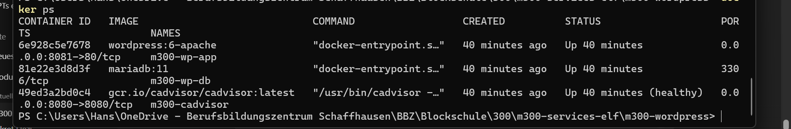

# M300 – WordPress als Web-Dienstleistung

## 1. Dienstleistungskonzept

### Dienstleistungskonzept

In diesem Projekt wurde eine Webhosting-Lösung mit Docker umgesetzt. Ziel ist es, eine Website für ein kleines oder mittleres Unternehmen bereitzustellen. Als Webanwendung wird WordPress verwendet, da es ein bekanntes und einfach zu bedienendes System für Websites ist.

Die Anwendung läuft in mehreren Docker-Containern. Ein Container enthält WordPress (Webserver), ein weiterer Container enthält die Datenbank (MariaDB). Dadurch sind die einzelnen Dienste voneinander getrennt und beeinflussen sich nicht direkt.

Der Vorteil dieser Lösung ist, dass sie einfach gestartet, gestoppt oder auf ein anderes System übertragen werden kann. Mit der Datei docker-compose.yml kann die gesamte Umgebung jederzeit neu erstellt werden.

Damit keine Daten verloren gehen, werden sogenannte Volumes verwendet. Diese speichern die Daten dauerhaft, auch wenn die Container neu gestartet werden.

Zusätzlich wird mit cAdvisor ein Monitoring eingesetzt. Damit kann überprüft werden, wie viel CPU und Arbeitsspeicher die Container verwenden.


### Warum diese Lösung?

 Viele KMU benötigen:

eine kostengünstige Website

einfache Wartung

Datensicherheit

schnelle Wiederherstellung bei Fehlern

Durch Docker kann die gesamte Umgebung reproduzierbar bereitgestellt werden.

## 2. Aufbau und Struktur des Projekts
### WordPress-Container
Dieser Container stellt die Website bereit. Er läuft auf Port 8081 und ist im Browser erreichbar.

### MariaDB-Container
Dieser Container speichert alle Daten der Website, zum Beispiel Beiträge, Benutzer und Einstellungen.
Die Datenbank ist nur intern im Docker-Netzwerk erreichbar und nicht von außen zugänglich.

### cAdvisor-Container
Dieser Container dient zur Überwachung (Monitoring).
Er zeigt an, wie viel CPU, Arbeitsspeicher und Netzwerk die Container verwenden.

Alle Container sind über ein eigenes Docker-Netzwerk miteinander verbunden. Dadurch können sie miteinander kommunizieren, sind aber vom restlichen System getrennt.

Zusätzlich werden sogenannte Volumes verwendet. Diese sorgen dafür, dass wichtige Daten (z.B. Datenbank und Website-Dateien) auch nach einem Neustart der Container erhalten bleiben.

Die gesamte Umgebung wird über die Datei docker-compose.yml gestartet und verwaltet. Mit einem einzigen Befehl können alle Container gleichzeitig gestartet oder gestoppt werden.

Die Container kommunizieren über ein eigenes Docker-Bridge-Netzwerk.
Docker stellt dabei ein internes DNS-System zur Verfügung, wodurch sich die Container über ihren Servicenamen z.b. db erreichen können.

Die Datenbank habe ich absichtlich nicht nach außen veröffentlicht, um die Sicherheit zu erhöhen. Dadurch kann nur der WordPress-Container auf die Datenbank zugreifen.

Diese Architektur sorgt für Isolation, Stabilität und eine klare Trennung der Dienste.

## 3. Konfiguration und Monitoring

Die Konfiguration der Anwendung erfolgt über die Datei `bash docker-compose.yml. `
Dort sind alle Container, Netzwerke und Volumes definiert.

Die Zugangsdaten für die Datenbank werden in einer .env Datei gespeichert. Dadurch stehen die Passwörter nicht direkt im Compose-File. Das erhöht die Sicherheit und Übersichtlichkeit.

Die Container werden mit folgendem Befehl gestartet:
```bash 
docker compose up -d
```


Zur Überwachung der Container wird cAdvisor eingesetzt.
cAdvisor zeigt die Nutzung von:

-CPU

-Arbeitsspeicher (RAM)

-Netzwerk

-Container-Status

Das Monitoring ist unter folgender Adresse erreichbar:


http://localhost:8080

Dadurch kann überprüft werden, ob die Container korrekt laufen und wie viele Ressourcen sie verwenden.

### Ressourcenoptimierung

Standardmässig dürfen Docker-Container unbegrenzt CPU und RAM verwenden. Um das Hostsystem zu schützen, wurden für den WordPress-Container Ressourcenlimits definiert.

Der Container wurde auf 512 MB RAM und 0.5 CPU begrenzt. Dadurch wird verhindert, dass ein einzelner Service zu viele Systemressourcen beansprucht.

Die Begrenzung wurde mit dem Befehl docker stats überprüft.

## 4. Netzwerk und Ports

Die Container sind über ein eigenes Docker-Bridge-Netzwerk miteinander verbunden. Dadurch können sie intern miteinander kommunizieren.

Folgende Ports werden verwendet:

| Dienst    | Externer Port | Interner Port | Zweck                 |
| --------- | ------------- | ------------- | --------------------- |
| WordPress | 8081          | 80            | Zugriff auf Website   |
| cAdvisor  | 8080          | 8080          | Monitoring            |
| MariaDB   | -             | 3306          | Nur intern erreichbar |

Die Datenbank wird nicht nach außen freigegeben.
Das erhöht die Sicherheit, da sie nur vom WordPress-Container erreichbar ist.
## 5. Volumes

Die Daten werden über sogenannte Named Volumes gespeichert. Dadurch bleiben wichtige Informationen auch nach einem Neustart der Container erhalten.

Folgende Volumes werden verwendet:

db_data – speichert die Datenbank dauerhaft

wp_data – speichert die WordPress-Dateien dauerhaft

Zum Test wurde ein Beitrag erstellt und danach die Container mit folgendem Befehl neu gestartet:
```bash
docker compose down
docker compose up -d
```
Der Beitrag war nach dem Neustart weiterhin vorhanden. Dadurch wurde bestätigt, dass die Volumes korrekt funktionieren.

## 6. Fehleranalyse und Problemlösung

Während der Umsetzung trat ein typisches Problem auf.


-Nach dem Start der Container konnte WordPress keine Verbindung zur Datenbank herstellen.
Im Browser erschien die Meldung:
```bash
Error establishing a database connection
```
### Ursache:

In der Datei docker-compose.yml war als Datenbank-Host „localhost“ eingetragen.

In Docker bedeutet „localhost“ jedoch der eigene Container.
Die Datenbank läuft aber in einem separaten Container mit dem Namen db.

Zur weiteren Analyse wurden die Docker-Logs überprüft:

docker compose logs wordpress

In den Logs konnte man sehen, dass keine Verbindung zur Datenbank aufgebaut werden konnte. Dadurch konnte ich den fehler finden und beheben.


### Lösung:

Der Datenbank-Host wurde von:
```bash
localhost
```
zu:
```bash
db:3306
```
geändert.

Nach dem Neustart der Container funktionierte die Verbindung zur Datenbank wieder korrekt.

## 7. Fazit

In diesem Projekt wurde erfolgreich eine containerisierte Webhosting-Lösung umgesetzt. Die Anwendung läuft stabil in mehreren Containern und kann jederzeit neu gestartet oder auf ein anderes System übertragen werden. Durch Monitoring und Fehleranalyse wurde die Funktionsfähigkeit der Lösung überprüft.