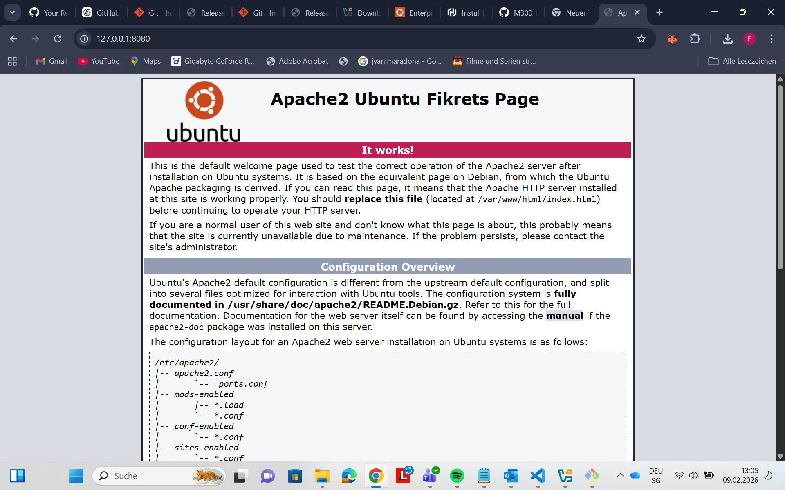
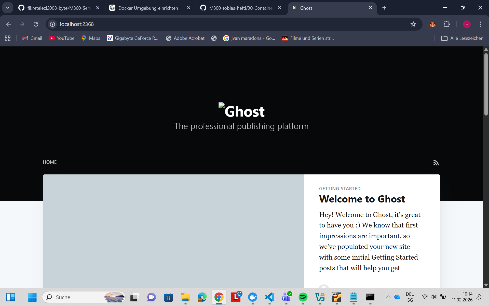
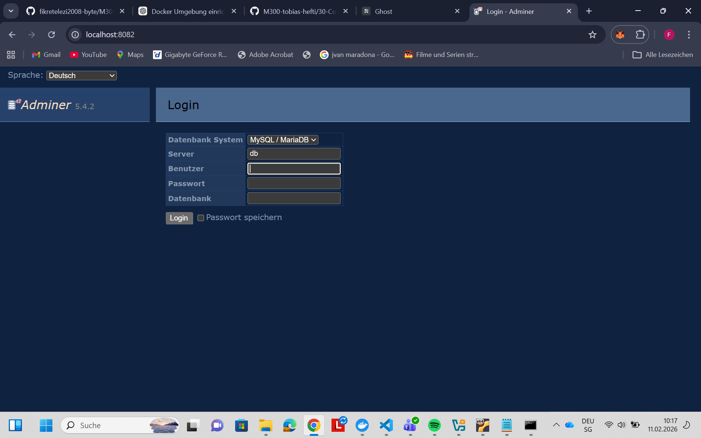

# M300-Services-ELF
# Dokumentation

## 1. Ziel der Arbeit

Ziel dieser Arbeit ist es, eine lokale Entwicklungs- und Testumgebung aufzubauen, in der virtuelle Maschinen automatisiert, konsistent und reproduzierbar erstellt werden.  
Dabei werden die theoretischen Konzepte der Infrastruktur-Automatisierung praktisch umgesetzt.

## 2. Voraussetzungen

Windows-PC mit aktivierter Virtualisierung (Intel VT-x / AMD-V)

Installierte Software:

- Git (Git Bash)
- VirtualBox
- Vagrant
- Visual Studio Code
- Internetverbindung

## 3. Theoretische Grundlagen – Infrastruktur-Automatisierung

### 3.1 Cloud Computing

Cloud Computing bezeichnet die Bereitstellung von IT-Ressourcen wie Rechenleistung, Speicher, Netzwerke und Software über ein Netzwerk, ohne dass diese lokal installiert sein müssen.

Man unterscheidet folgende Servicemodelle:

- IaaS (Infrastructure as a Service): Virtuelle Maschinen und Infrastruktur
- PaaS (Platform as a Service): Laufzeitumgebungen für Anwendungen
- SaaS (Software as a Service): Fertige Anwendungen
- CaaS (Container as a Service): Containerisierte Anwendungen (z. B. Docker, Kubernetes)

### 3.2 Dynamische Infrastruktur-Plattformen

Eine dynamische Infrastruktur-Plattform stellt virtualisierte Ressourcen wie Compute, Storage und Network bereit und verwaltet diese programmgesteuert.  
Die Bereitstellung erfolgt über virtuelle Maschinen (VMs).

Beispiele:

- Public Cloud: AWS, Azure, Google Cloud
- Private Cloud: OpenStack, VMware vCloud
- Lokale Virtualisierung: VirtualBox

Voraussetzungen für Automatisierung:

- programmierbar (API)
- on-demand
- self-service
- portabel
- sicher

### 3.3 Infrastructure as Code (IaC)

Infrastructure as Code ist ein Paradigma, bei dem Infrastruktur wie Software behandelt wird.  
Systeme werden in Dateien definiert, versioniert und automatisiert ausgerollt.

Ziele von IaC:

- konsistente und reproduzierbare Systeme
- schnelle Änderungen ohne manuellen Aufwand
- weniger Fehler durch Automatisierung
- einfache Wiederherstellung von Systemen
- kontinuierliche Verbesserungen

### 3.4 Vagrant

Vagrant ist ein Open-Source-Tool zur Erstellung und Verwaltung von virtuellen Maschinen über die Kommandozeile.  
Die Konfiguration erfolgt über ein Vagrantfile, das beschreibt:

- Betriebssystem
- Virtualisierungs-Provider
- Netzwerk-Konfiguration
- Provisionierung (automatische Software-Installation)

### 3.5 Aufgabenbezug

Die theoretischen Inhalte dienen ausschliesslich als Informations- und Grundlagenmaterial.  
Direkte Aufgaben sind nicht im Fliesstext enthalten, sondern befinden sich in:

- separaten Fragendateien
- Hands-on-Aufgaben
- Beispiel-Verzeichnissen (z. B. vagrant/web)

## 4. Praktischer Teil – Einrichtung der Umgebung

### 4.1 Git konfigurieren

```bash
git config --global user.name "fikretelezi"
git config --global user.email "fikretelezi2008@gmail.com"
```
*4.2 SSH-Key erstellen (GitHub)
```bash
ssh-keygen -t rsa -b 4096 -C "fikretelezi2008@gmail.com"
```
Der Public Key wurde zu GitHub hinzugefügt und erfolgreich getestet:
```bash
ssh -T git@github.com
```
4.3 Projektstruktur erstellen
```cd "/c/Users/Hans/OneDrive - Berufsbildungszentrum Schaffhausen/BBZ/Blockschule/300"
mkdir -p vagrant/web
cd vagrant/web
```
5. Apache Webserver automatisiert mit Vagrant
5.1 Vagrantfile erstellen
```bash
vagrant init ubuntu/jammy64
```
5.2 Vagrantfile konfigurieren
```bash
Vagrant.configure("2") do |config|
  config.vm.box = "ubuntu/jammy64"

  config.vm.network "forwarded_port", guest: 80, host: 8080

  config.vm.provision "shell", inline: <<-SHELL
    apt update
    apt install -y apache2
    systemctl enable apache2
    systemctl start apache2
  SHELL
end
```
VM starten
```bash
vagrant up
```
Verbindung zur VM
```bash
vagrant ssh
```
6. Apache überprüfen
6.1 Service-Status
```bash
sudo systemctl status apache2
Ergebnis:

Active: active (running)
```
6.2 Test mit curl
```bash
curl http://localhost
```
6.3 Test im Browser
```bash
http://127.0.0.1:8080
```

Die Apache-Standardseite wird angezeigt.



1. HTML-Titel anpassen
```bash
sudo nano /var/www/html/index.html
```

# LB 3 – Docker Hands-on

## 1. Umgebung funktionsfähig auf eigenem Notebook

Docker wurde nativ auf dem eigenen Notebook installiert (Docker Desktop).

Die Funktionsfähigkeit der Docker-Umgebung wurde mit folgendem Befehl überprüft:

docker run hello-world

Die erfolgreiche Ausgabe bestätigt, dass Docker korrekt installiert und lauffähig ist.


## 2. Bestehende Docker Container kombinieren (Frontend & Backend)

Ziel ist die Kombination eines Backends (Datenbank) mit einem Frontend (Web-Applikation).

Verwendete Container:
- Backend: mysql:5.7
- Frontend: ghost:1-alpine
- Datenbankverwaltung: adminer

### Docker Netzwerk erstellen
```bash
docker network create lb3net
```

### MySQL Container starten (Backend)
```bash
docker run -d --name ghost_mysql --network lb3net \
  -e MYSQL_ROOT_PASSWORD=admin \
  -e MYSQL_USER=ghost \
  -e MYSQL_PASSWORD=secret \
  -e MYSQL_DATABASE=ghost \
  mysql:5.7
```

### Ghost Container starten (Frontend)
```bash
docker run -d --name ghost --network lb3net \
  -e database__client=mysql \
  -e database__connection__host=ghost_mysql \
  -e database__connection__user=ghost \
  -e database__connection__password=secret \
  -e database__connection__database=ghost \
  -p 2368:2368 \
  ghost:1-alpine
```

### Adminer starten (Datenbankverwaltung)
```bash
docker run -d --name adminer --network lb3net -p 8082:8080 adminer
```

### Funktionstest

Ghost Webinterface:
http://localhost:2368

Adminer Webinterface:
http://localhost:8082
$
Status prüfen:
```bash
docker ps
```

## 3. Eigener Docker Container erstellen (Dockerfile)

Für den eigenen Container wurde ein Dockerfile erstellt, welches einen Apache-Webserver enthält.
Dies stellt die Umwandlung eines Vagrantfiles in ein Dockerfile dar.

### Dockerfile

FROM ubuntu:22.04
```bash
RUN apt-get update && \
    apt-get -y install apache2 curl && \
    apt-get clean && rm -rf /var/lib/apt/lists/*

ENV APACHE_RUN_USER=www-data
ENV APACHE_RUN_GROUP=www-data
ENV APACHE_LOG_DIR=/var/log/apache2

RUN mkdir -p /var/lock/apache2 /var/run/apache2

EXPOSE 80
VOLUME /var/www/html

HEALTHCHECK --interval=30s --timeout=5s --retries=3 \
  CMD curl -fs http://localhost/ || exit 1

CMD ["/bin/bash", "-c", "source /etc/apache2/envvars && exec /usr/sbin/apache2 -DFOREGROUND"]
```

### Docker Image erstellen
```bash
docker build -t puh .
```

### Container starten
```bash
docker run -d --name puh_container -p 8080:80 puh
```

### Funktionstest
```bash
curl http://localhost:8080
```
oder im Browser:
http://localhost:8080


## 4. Container sichern und beschränken (Ressourcenlimits)

Um sicherzustellen, dass Container nicht unbeschränkt Systemressourcen beanspruchen,
wurden CPU- und RAM-Limits gesetzt.

### Container mit Limits starten
```bash
docker run -d --name puh_container -p 8080:80 \
  --memory=256m --cpus=0.5 --pids-limit=100 \
  puh
```

### Kontrolle der Limits
```bash
docker stats --no-stream
```

## 5. Health Check

Im Dockerfile wurde ein HEALTHCHECK definiert, welcher regelmässig prüft,
ob der Apache-Webserver erreichbar ist.


## Fazit

- Docker Umgebung erfolgreich eingerichtet
- Frontend und Backend Container kombiniert
- Eigener Docker Container mittels Dockerfile erstellt
- Ressourcenbeschränkungen implementiert
- Healthcheck integriert


 30 Container Zusammenfassung

## Lernziel
Applikationen und Services können als Container betrieben werden.
Eigene Container können als Images gebaut und über Registries (z.B. Docker Hub oder private Registry) für Dritte bereitgestellt werden.

## 1. Container
Container ermöglichen es, Software in isolierten Umgebungen auszuführen.
Sie laufen überall gleich: lokal, im Rechenzentrum oder in der Cloud.

### Vorteile von Containern
- Teilen Ressourcen mit dem Host-Betriebssystem
- Sehr schnell start- und stoppbar
- Kaum Overhead
- Portierbar („läuft bei mir“-Problem entfällt)
- Leichtgewichtig (viele Container parallel)
- Cloud-ready

### Microservices
Container sind ideal für Microservices.
Ein System besteht aus kleinen, unabhängigen Services, die über das Netzwerk kommunizieren.
Diese können unabhängig entwickelt, deployt und horizontal skaliert werden (scale-out).

## 2. Docker
Docker ist eine Plattform zum Erstellen, Ausführen und Verteilen von Containern.

### Architektur
- Docker Daemon: baut Images, startet und überwacht Container
- Docker Client: Kommandozeilen-Interface (CLI)
- Images: unveränderbare Vorlagen für Container
- Container: laufende Instanzen von Images
- Registry: Speicher und Verteilung von Images (z.B. Docker Hub)

## Wichtige Docker Befehle

### Docker testen
```bash
docker run hello-world
```
### Container starten
```bash
docker run -it ubuntu /bin/bash
docker run -d ubuntu sleep 20
docker run -d --rm ubuntu sleep 20
```
### Container anzeigen
```bash
docker ps
docker ps -a
```
### Images anzeigen
```bash
docker images
docker image ls
```
### Container stoppen / starten
```bash
docker stop <container>
docker start <container>
docker kill <container>
```
### Container löschen
```bash
docker rm <container>
docker rm -f `docker ps -a -q`
```
### Images löschen
```bash
docker rmi <image>
docker rmi `docker images -q -f dangling=true`
```
### Logs und Informationen
```bash
docker logs <container>
docker inspect <container>
docker diff <container>
docker top <container>
```
## Dockerfile
Ein Dockerfile ist eine Textdatei mit Anweisungen zum Erstellen eines Docker Images.

### Image bauen
```bash
docker build -t meinimage .
```
### Container starten
```bash
docker run --rm -d --name meincontainer meinimage
```
### Im Container prüfen
```bash
docker exec -it meincontainer bash
ps -ef
netstat -tulpen
```
### Wichtige Dockerfile Anweisungen

FROM        Base Image festlegen
RUN         Befehle im Image ausführen
COPY        Dateien ins Image kopieren
ADD         Dateien oder URLs ins Image kopieren
ENV         Umgebungsvariablen setzen
EXPOSE      Port dokumentieren
VOLUME      Persistente Daten definieren
WORKDIR    Arbeitsverzeichnis setzen
CMD         Standardbefehl beim Start
ENTRYPOINT  Fixer Startbefehl
HEALTHCHECK Container-Zustand prüfen

## Netzwerk-Anbindung
Container werden über Port-Mapping erreichbar gemacht.

Beispiele:
```bash
docker run -d -p 8080:80 httpd
docker run -d -P mysql
```
## Volumes
Volumes ermöglichen persistente Daten über den Lebenszyklus eines Containers hinaus.

Beispiele:
```bash
docker volume create myvolume
docker run -it --rm -v myvolume:/data busybox sh
```
## Image-Bereitstellung
Eigene Images können für andere bereitgestellt werden.

### Image taggen
```bash
docker tag meinimage username/meinimage:1.0
```
### Image pushen (Docker Hub)
```bash
docker push username/meinimage:1.0
```
### Image exportieren / importieren
```bash
docker save meinimage -o meinimage.tar
docker load -i meinimage.tar
```
Änderung:

<title>M300 – Apache Webserver</title>
<h1>Apache Webserver – Modul 300</h1>
<p>Erstellt von Fikret</p>
